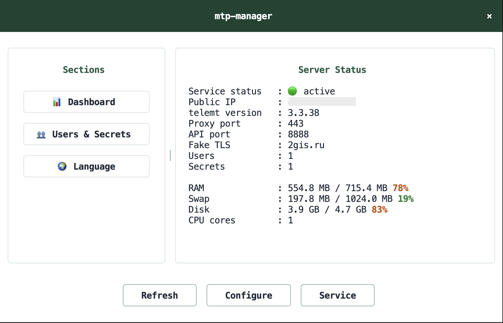
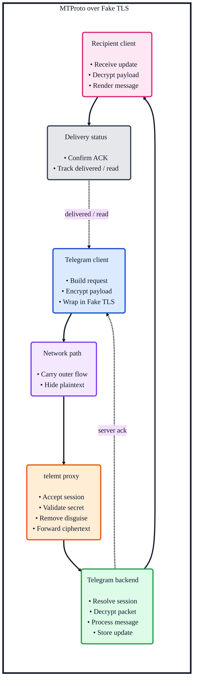

<h1 align="center">mtp-manager</h1>

<p align="center">
  Minimal terminal UI for managing
  <a href="https://github.com/telemt/telemt">telemt</a>
  on Debian, Ubuntu, Fedora, and Arch Linux
</p>

<p align="center">
  <a href="https://docs.python.org/3/">
    
  </a>
  <a href="https://textual.textualize.io/">
    
  </a>
  <a href="https://ubuntu.com/server">
    
  </a>
  <a href="https://github.com/telemt/telemt">
    
  </a>
</p>

<p align="center">
  <a href="src/i18n/en.py">
    
  </a>
  <a href="src/i18n/ru.py">
    
  </a>
  <a href="src/i18n/zh.py">
    
  </a>
</p>

<p align="center">
  
</p>

## Overview

`mtp-manager` is a lightweight TUI for installing, configuring, and operating a `telemt`-based MTProto proxy with Fake TLS support. It is designed for small VPS setups where a compact workflow matters more than a large control panel.

## Highlights

- install and update `telemt`
- install a specific tag or commit
- manage users and secrets
- export `raw`, `dd`, and `ee` links
- inspect service status and logs
- run cleanup tasks for logs, cache, and runtime artifacts
- switch the interface between English, Russian, and Chinese

## Request Flow

The diagram below shows the high-level path of an MTProto message when `telemt` is used as the proxy layer with Fake TLS enabled.



## Quick Start

```bash
source setup.sh
mtp-manager
```

`setup.sh` is meant to be sourced from `bash` or `zsh`. It prepares `.venv`, installs the project in editable mode, validates the entrypoint, and activates the environment in the current shell.

## Requirements

- Python `3.11+`
- Debian, Ubuntu, Fedora, or Arch Linux
- `systemd`
- root privileges for install, service, firewall, and cleanup operations

## Project Layout

| Path | Purpose |
| --- | --- |
| `src/app.py` | CLI entrypoint and internal service commands |
| `src/bootstrap.py` | Dependency wiring and startup migration glue |
| `src/controller.py` | Application actions used by the TUI |
| `src/infra/` | shell, locale, storage, firewall, public IP, `systemd` |
| `src/models/` | typed domain models |
| `src/services/` | install, runtime, diagnostics, cleanup, inventory |
| `src/ui/backend.py` | UI backend abstraction used by the app entrypoint |
| `src/ui/textual_app.py` | main TUI orchestration |
| `src/ui/modals.py` | modal screens and shared popup UI |
| `src/ui/dashboard.py` | dashboard rendering and host metrics |
| `src/ui/actions.py` | action definitions and menu helpers |
| `src/ui/lists.py` | sections, users, and secrets list helpers |
| `src/i18n/` | English, Russian, and Chinese catalogs |

## Managed Paths

| Path | Purpose |
| --- | --- |
| `/etc/mtp-manager` | managed config directory |
| `/var/lib/mtp-manager` | app data |
| `/opt/telemt` | installed telemt binary |
| `/etc/systemd/system/telemt.service` | main service unit |
| `/etc/systemd/system/telemt-config-refresh.*` | config refresh service and timer |
| `/etc/systemd/system/mtp-manager-cleanup.*` | cleanup service and timer |

## Notes

- shell execution is routed through the infra layer
- generated files are written atomically
- managed `systemd` units invoke the installed `mtp-manager` entrypoint
- migration logic for older `mtproxy` layouts is included
