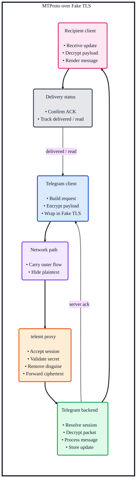

<h1 align="center">mtp-manager</h1>

<p align="center">
  TUI manager for
  <a href="https://github.com/telemt/telemt">telemt</a>
  on Debian and Ubuntu
</p>

<p align="center">
  Install, update, configure, and operate a telemt-based MTProto proxy from a compact terminal UI.
</p>

<p align="center">
  <a href="https://docs.python.org/3/">
    
  </a>
  <a href="https://textual.textualize.io/">
    
  </a>
  <a href="https://ubuntu.com/server">
    
  </a>
  <a href="https://github.com/telemt/telemt">
    
  </a>
</p>

<p align="center">
  
</p>

## Features

- Install and update `telemt`
- Install a specific `tag` or `commit`
- Generate and refresh runtime configuration
- Manage `systemd` units and timers
- Manage users and secrets
- Export `raw`, `dd`, and `ee` secret formats
- View service status and logs
- Run cleanup tasks for logs, cache, and runtime artifacts


## Request Flow

The diagram below shows the high-level path of an MTProto message when `telemt` is used as the proxy layer with Fake TLS enabled.



## Quick Start

```bash
source setup.sh
mtp-manager
```

`setup.sh` is designed to be loaded with `source` from `bash` or `zsh`. It prepares `.venv`, installs the project in editable mode, validates the installed entrypoint, and activates the environment in the current shell.

## Requirements

- Python `3.11+`
- Debian or Ubuntu
- `systemd`
- root privileges for install, service, firewall, locale, and cleanup actions

## Project Layout

| Path | Purpose |
| --- | --- |
| `src/app.py` | CLI entrypoint and internal service commands |
| `src/bootstrap.py` | Dependency wiring and startup migration glue |
| `src/controller.py` | Application-level actions used by the TUI |
| `src/services/` | `telemt` install, runtime, diagnostics, cleanup, inventory |
| `src/infra/` | Shell, storage, locale, public IP, firewall, `systemd` |
| `src/ui/textual_app.py` | Main TUI orchestration |
| `src/ui/modals.py` | Modal screens and shared popup UI |
| `src/ui/dashboard.py` | Dashboard rendering and host metrics |
| `src/ui/actions.py` | Action definitions and menu helpers |
| `src/ui/lists.py` | Sections, users, and secrets list helpers |
| `src/models/` | Typed domain models |
| `src/i18n/` | EN and RU catalogs |

## Managed Paths

- config directory: `/etc/mtp-manager`
- app data: `/var/lib/mtp-manager`
- binary directory: `/opt/telemt`
- main unit: `/etc/systemd/system/telemt.service`
- config refresh unit/timer:
  - `/etc/systemd/system/telemt-config-update.service`
  - `/etc/systemd/system/telemt-config-update.timer`
- cleanup unit/timer:
  - `/etc/systemd/system/telemt-cleanup.service`
  - `/etc/systemd/system/telemt-cleanup.timer`

## Notes

- shell execution is routed through the infra layer
- generated files are written atomically
- managed `systemd` units invoke the installed `mtp-manager` entrypoint
- the project includes migration logic for older `mtproxy`-based layouts
